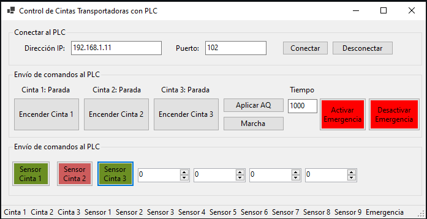
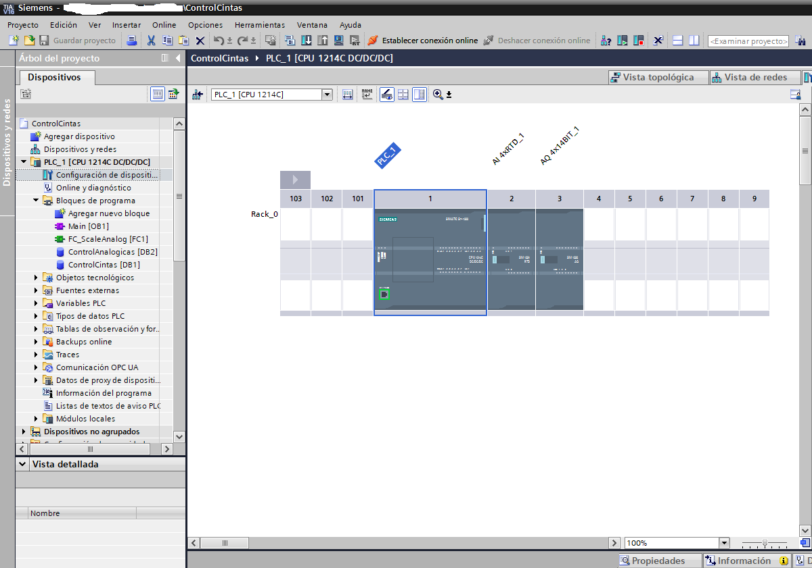
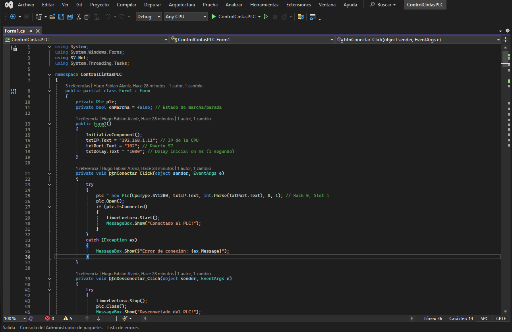

# ControlCintasPLC
Control de 3 cintas transportadoras, leer el estado de entradas digitales con sensores, leer el estado de 4 entradas analogicas RTD y escribir en 4 salidas analogicas 4-20mA, usando un PLC Siemens S7-1200.
Interfaz de usuario (UI) desarrollada en C# con .NET 9 y WinForms. 
Este es un proyecto de automatización industrial común, que involucra programación del PLC (usando TIA Portal) y comunicación Ethernet entre la app C# y el PLC. 
Esta es una guía para implementar proyectos basicos y escalables en complejidad, esta basado en la biblioteca S7NetPlus, que es gratuita y compatible con S7-1200.

# Configuración del PLC S7-1200
## Hardware necesario:

PLC S7-1200 con módulo Ethernet (integrado en la mayoría).
3 salidas digitales para controlar los motores de las cintas (por ejemplo, relés o módulos de salida para motores).
Entradas para sensores (ej. botones de start/stop, sensores de proximidad para detectar objetos en las cintas).
Asume que las cintas son controladas por bits en un Data Block (DB) o memorias M.

## Para cada cinta: 
Un contacto normally open (NO) ligado al bit de control, que activa la salida del motor (ej. %Q0.0 para cinta 1).
Lógica básica para una cinta transportadora: Start button (%I0.0) sella el bit On, Stop button (%I0.1) lo resetea. Sensor de fin de línea apaga automáticamente si detecta objeto.
Para 3 cintas secuenciales: La cinta 2 se activa solo si la 1 está en marcha y hay un objeto detectado, etc.
Para 3 cintas con enecendido y apagado automatico con tiempo programable entre cada encendido/apagado

## Ejemplo de lógica simple para una cinta (extiende a 3):
En el OB1 (ciclo principal), se usa lógica simple para controlar salidas.

%I0.2      Cinta1_On    %I1.1           %Q0.1

----| |--------| |------|/|-------------|/|------------( )

Si Start presionado y no Stop, enciende motor.
Si sensor detecta atasco o fin, apaga.

## Desarrollo de la UI en C# .NET 9 WinForms
La UI se ha desarrollado en Visual Studio con .NET 9 usando la biblioteca S7netplus para la comunicacion con el PLC.

## Diseño de la UI:
Botones para cada cinta: "Encender Cinta 1", "Apagar Cinta 1", etc.

Labels o LEDs (usa PictureBox con imágenes verde/rojo) para mostrar estado (On/Off).

Un TextBox para la IP del PLC y un botón "Conectar".

Un Timer para leer estados periódicamente (cada 500ms).

## Pruebas
Ejecuta PLCSIM, descarga programa, RUN.

Inicia NetToPLCSim, conecta, crea un servidor usando las IP asignadas.

Ejecuta la app C#, conecta a IP de NetToPLCSim:502 (ej. 192.168.1.11:102), el puerto 102 se asigna por defecto.

Debes ejecutar NetToPLCSim en modo administrador para que cierre s7iexe, de lo contrario no estará disponible el puerto 102.

Enciende/apaga, verifica estados en TIA Portal (DB1) y salidas simuladas.

Código para comunicación con el PLC:

Para conectar vía Ethernet (rack 0, slot 1 para S7-1200)

